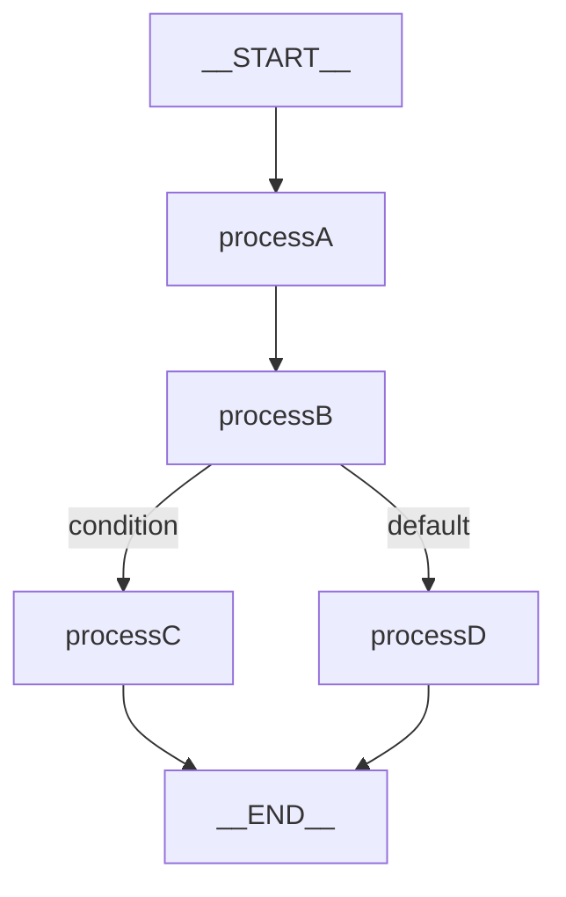

# Graph Core 功能开发指南

本文档提供 Spring AI Alibaba Graph Core 模块的实践开发指南，包含常见使用场景的代码示例和最佳实践。

## 1. 快速开始

### 1.1 依赖引入

```xml
<dependency>
    <groupId>com.alibaba.cloud.ai</groupId>
    <artifactId>spring-ai-alibaba-graph-core</artifactId>
</dependency>
```

### 1.2 最简示例

```java
// 1. 创建状态图
StateGraph graph = new StateGraph()
    // 添加节点
    .addNode("greet", (state) -> {
        String name = state.value("name", "World");
        return CompletableFuture.completedFuture(Map.of(
            "message", "Hello, " + name + "!"
        ));
    })
    // 添加边
    .addEdge(StateGraph.START, "greet")
    .addEdge("greet", StateGraph.END);

// 2. 编译图
CompiledGraph compiled = graph.compile();

// 3. 执行
Optional<OverAllState> result = compiled.invoke(Map.of("name", "Alice"));

// 4. 获取结果
result.ifPresent(state -> {
    System.out.println(state.value("message").orElse("No message"));
});
// 输出: Hello, Alice!
```

---

## 2. 基础图创建

### 2.1 定义状态结构

使用 `KeyStrategyFactory` 定义状态字段的合并策略：

```java
// 方式一：使用 Builder
KeyStrategyFactory factory = KeyStrategyFactoryBuilder.builder()
    .withKey("messages", new AppendStrategy())       // 消息列表：追加
    .withKey("context", new ReplaceStrategy())       // 上下文：替换
    .withKey("metadata", new MergeStrategy())        // 元数据：合并
    .build();

// 方式二：使用 Lambda
KeyStrategyFactory factory = () -> Map.of(
    "messages", KeyStrategy.APPEND,
    "result", KeyStrategy.REPLACE
);

// 创建状态图
StateGraph graph = new StateGraph(factory);
```

### 2.2 添加节点

**基本节点：**
```java
// 简单节点（无配置）
graph.addNode("process", (state) -> {
    // 业务逻辑
    String input = state.value("input", "");
    return CompletableFuture.completedFuture(Map.of(
        "result", "processed: " + input
    ));
});

// 带配置的节点
graph.addNode("processWithConfig", (state, config) -> {
    // 访问配置
    String threadId = config.getThread_id();
    return CompletableFuture.completedFuture(Map.of(
        "threadId", threadId
    ));
});
```

**子图节点：**
```java
// 定义子图
StateGraph subGraph = new StateGraph()
    .addNode("step1", step1Action)
    .addNode("step2", step2Action)
    .addEdge(StateGraph.START, "step1")
    .addEdge("step1", "step2")
    .addEdge("step2", StateGraph.END);

// 添加为节点
graph.addNode("subProcess", subGraph);
```

### 2.3 添加边

**固定边：**
```java
// 单向边
graph.addEdge("nodeA", "nodeB");

// 从 START 开始
graph.addEdge(StateGraph.START, "entryNode");

// 到 END 结束
graph.addEdge("lastNode", StateGraph.END);
```

**并行边：**
```java
// 一对多：同时执行多个节点
graph.addEdge("fork", List.of("branchA", "branchB", "branchC"));

// 多对一：多个节点汇聚到一个节点
graph.addEdge(List.of("branchA", "branchB"), "join");
```

### 2.4 完整示例：简单工作流

```java
// 定义状态策略
KeyStrategyFactory factory = KeyStrategyFactoryBuilder.builder()
    .withKey("input", new ReplaceStrategy())
    .withKey("processedData", new ReplaceStrategy())
    .withKey("result", new ReplaceStrategy())
    .build();

StateGraph graph = new StateGraph(factory)
    // 添加节点
    .addNode("loadData", (state) -> {
        String input = state.value("input", "");
        return CompletableFuture.completedFuture(Map.of(
            "processedData", "loaded: " + input
        ));
    })
    .addNode("processData", (state) -> {
        String data = state.value("processedData", "");
        return CompletableFuture.completedFuture(Map.of(
            "processedData", "processed: " + data
        ));
    })
    .addNode("saveResult", (state) -> {
        String data = state.value("processedData", "");
        return CompletableFuture.completedFuture(Map.of(
            "result", "saved: " + data
        ));
    })
    // 添加边
    .addEdge(StateGraph.START, "loadData")
    .addEdge("loadData", "processData")
    .addEdge("processData", "saveResult")
    .addEdge("saveResult", StateGraph.END);

// 执行
CompiledGraph compiled = graph.compile();
Optional<OverAllState> result = compiled.invoke(Map.of("input", "test-data"));
```

---

## 3. 条件路由

### 3.1 基本条件路由

```java
graph.addConditionalEdges("router",
    // 条件判断函数：返回路由键
    (state, config) -> {
        String type = state.value("type", "default");
        return CompletableFuture.completedFuture(new Command(type));
    },
    // 路由映射表
    Map.of(
        "typeA", "processA",
        "typeB", "processB",
        "default", "processDefault"
    )
);
```

### 3.2 带状态更新的条件路由

```java
graph.addConditionalEdges("router",
    (state, config) -> {
        String decision = makeDecision(state);

        // 返回 Command 包含状态更新
        return CompletableFuture.completedFuture(new Command(
            decision,                           // 目标节点键
            Map.of("routedAt", Instant.now())   // 状态更新
        ));
    },
    Map.of(
        "approve", "approvalFlow",
        "reject", "rejectionFlow",
        "review", "reviewFlow"
    )
);
```

### 3.3 完整示例：审批流程

```java
StateGraph graph = new StateGraph()
    .addNode("submit", (state) -> {
        return CompletableFuture.completedFuture(Map.of(
            "status", "submitted"
        ));
    })
    .addNode("approve", (state) -> {
        return CompletableFuture.completedFuture(Map.of(
            "status", "approved",
            "approvedAt", Instant.now()
        ));
    })
    .addNode("reject", (state) -> {
        return CompletableFuture.completedFuture(Map.of(
            "status", "rejected"
        ));
    })
    .addNode("review", (state) -> {
        return CompletableFuture.completedFuture(Map.of(
            "status", "under_review"
        ));
    })
    .addNode("complete", (state) -> {
        return CompletableFuture.completedFuture(Map.of(
            "completedAt", Instant.now()
        ));
    })
    // 从 START 到提交节点
    .addEdge(StateGraph.START, "submit")
    // 条件路由
    .addConditionalEdges("submit",
        (state, config) -> {
            String action = state.value("action", "review");
            return CompletableFuture.completedFuture(new Command(action));
        },
        Map.of(
            "approve", "approve",
            "reject", "reject",
            "review", "review"
        )
    )
    // 各分支汇聚到完成节点
    .addEdge("approve", "complete")
    .addEdge("reject", "complete")
    .addEdge("review", "complete")
    .addEdge("complete", StateGraph.END);

CompiledGraph compiled = graph.compile();
```

---

## 4. 并行执行

### 4.1 固定并行分支

```java
StateGraph graph = new StateGraph()
    .addNode("start", startAction)
    .addNode("analyzeData", analyzeAction)
    .addNode("generateReport", reportAction)
    .addNode("sendNotification", notifyAction)
    .addNode("aggregate", aggregateAction)

    // START
    .addEdge(StateGraph.START, "start")

    // 并行执行三个分支
    .addEdge("start", List.of("analyzeData", "generateReport", "sendNotification"))

    // 汇聚
    .addEdge(List.of("analyzeData", "generateReport", "sendNotification"), "aggregate")

    // END
    .addEdge("aggregate", StateGraph.END);
```

### 4.2 条件并行分支

```java
graph.addParallelConditionalEdges("start",
    // 返回要执行的分支列表
    (state, config) -> {
        List<String> branches = new ArrayList<>();

        if (state.value("needAnalysis", true)) {
            branches.add("analyze");
        }
        if (state.value("needReport", true)) {
            branches.add("report");
        }
        if (state.value("needNotification", false)) {
            branches.add("notify");
        }

        return CompletableFuture.completedFuture(branches);
    },
    Map.of(
        "analyze", "analyzeData",
        "report", "generateReport",
        "notify", "sendNotification"
    )
);
```

### 4.3 并行状态合并

并行分支执行完成后，状态会根据 `KeyStrategy` 自动合并：

```java
KeyStrategyFactory factory = KeyStrategyFactoryBuilder.builder()
    // 分析结果：替换
    .withKey("analysisResult", new ReplaceStrategy())
    // 报告数据：替换
    .withKey("reportData", new ReplaceStrategy())
    // 通知记录：追加
    .withKey("notifications", new AppendStrategy())
    .build();
```

---

## 5. 持久化配置

### 5.1 内存持久化

```java
// 默认使用内存持久化
CompiledGraph compiled = graph.compile();

// 或显式配置
SaverConfig saverConfig = SaverConfig.builder()
    .register(new MemorySaver())
    .build();

CompileConfig config = CompileConfig.builder()
    .saverConfig(saverConfig)
    .build();

CompiledGraph compiled = graph.compile(config);
```

### 5.2 文件系统持久化

```java
FileSystemSaver fileSaver = FileSystemSaver.builder()
    .baseDirectory(Paths.get("/tmp/graph-checkpoints"))
    .stateSerializer(new SpringAIJacksonStateSerializer(OverAllState::new, new ObjectMapper()))
    .build();

SaverConfig saverConfig = SaverConfig.builder()
    .register(fileSaver)
    .build();

CompileConfig config = CompileConfig.builder()
    .saverConfig(saverConfig)
    .build();
```

### 5.3 PostgreSQL 持久化

```java
PostgresSaver postgresSaver = PostgresSaver.builder()
    .host("localhost")
    .port(5432)
    .database("graph_db")
    .user("postgres")
    .password("password")
    .createTables(true)  // 自动创建表
    .build();

SaverConfig saverConfig = SaverConfig.builder()
    .register(postgresSaver)
    .build();

CompileConfig config = CompileConfig.builder()
    .saverConfig(saverConfig)
    .build();

CompiledGraph compiled = graph.compile(config);
```

### 5.4 MySQL 持久化

```java
MysqlSaver mysqlSaver = MysqlSaver.builder()
    .host("localhost")
    .port(3306)
    .database("graph_db")
    .user("root")
    .password("password")
    .createTables(true)
    .build();
```

### 5.5 Redis 持久化

```java
RedisSaver redisSaver = RedisSaver.builder()
    .host("localhost")
    .port(6379)
    .password("password")
    .database(0)
    .ttl(Duration.ofHours(24))  // 过期时间
    .build();
```

### 5.6 MongoDB 持久化

```java
MongoSaver mongoSaver = MongoSaver.builder()
    .connectionString("mongodb://localhost:27017")
    .database("graph_db")
    .collection("checkpoints")
    .build();
```

---

## 6. 状态恢复与中断

### 6.1 配置中断点

```java
CompileConfig config = CompileConfig.builder()
    .saverConfig(saverConfig)
    // 在指定节点前中断
    .interruptsBefore(List.of("humanReview"))
    // 在指定节点后中断
    .interruptsAfter(List.of("dataProcess"))
    .build();
```

### 6.2 执行并获取中断状态

```java
// 首次执行
RunnableConfig runConfig = RunnableConfig.builder()
    .thread_id("thread-001")
    .build();

Optional<OverAllState> result = compiled.invoke(Map.of(
    "input", "test-data"
), runConfig);

// 检查是否被中断
if (result.isEmpty()) {
    // 获取中断状态
    StateSnapshot snapshot = compiled.getState(runConfig);
    System.out.println("Interrupted at: " + snapshot.getNodeId());
    System.out.println("State: " + snapshot.getState().data());
}
```

### 6.3 更新状态并恢复执行

```java
// 获取当前状态
RunnableConfig runConfig = RunnableConfig.builder()
    .thread_id("thread-001")
    .build();

StateSnapshot snapshot = compiled.getState(runConfig);

// 人工审批后更新状态
RunnableConfig updatedConfig = compiled.updateState(
    runConfig,
    Map.of(
        "approved", true,
        "reviewComment", "Approved by admin",
        "reviewer", "admin"
    )
);

// 恢复执行
Optional<OverAllState> finalResult = compiled.invoke(null, updatedConfig);
```

### 6.4 查看执行历史

```java
// 获取所有检查点历史
Collection<StateSnapshot> history = compiled.getStateHistory(runConfig);

for (StateSnapshot snap : history) {
    System.out.println("Node: " + snap.getNodeId());
    System.out.println("Next: " + snap.getNextNodeId());
    System.out.println("State: " + snap.getState().data());
    System.out.println("---");
}
```

---

## 7. 流式执行

### 7.1 基本流式执行

```java
Flux<NodeOutput> stream = compiled.stream(Map.of("input", "test"));

stream.doOnNext(output -> {
    System.out.println("Node: " + output.getNodeId());
    System.out.println("State: " + output.getState().data());
}).blockLast();
```

### 7.2 带配置的流式执行

```java
RunnableConfig config = RunnableConfig.builder()
    .thread_id("stream-thread")
    .build();

Flux<NodeOutput> stream = compiled.stream(Map.of("input", "test"), config);

stream.subscribe(
    output -> System.out.println("Received: " + output.getNodeId()),
    error -> System.err.println("Error: " + error.getMessage()),
    () -> System.out.println("Completed")
);
```

### 7.3 获取带快照的流

```java
RunnableConfig config = RunnableConfig.builder()
    .thread_id("snapshot-thread")
    .build();

Flux<NodeOutput> snapshotStream = compiled.streamSnapshots(Map.of("input", "test"), config);

snapshotStream.doOnNext(output -> {
    // 每个 output 都包含检查点信息
    Optional<Checkpoint> checkpoint = output.getCheckpoint();
    checkpoint.ifPresent(cp -> {
        System.out.println("Checkpoint ID: " + cp.getId());
    });
}).blockLast();
```

---

## 8. 生命周期监听

### 8.1 实现监听器

```java
public class MyLifecycleListener implements GraphLifecycleListener {

    private static final Logger log = LoggerFactory.getLogger(MyLifecycleListener.class);

    @Override
    public void onStart(RunnableConfig config, OverAllState state) {
        log.info("Graph started - Thread: {}", config.getThread_id());
    }

    @Override
    public void onEnd(RunnableConfig config, OverAllState state) {
        log.info("Graph completed - Thread: {}", config.getThread_id());
        log.info("Final state: {}", state.data());
    }

    @Override
    public void onError(RunnableConfig config, OverAllState state, Exception e) {
        log.error("Graph error - Thread: {}", config.getThread_id(), e);
    }

    @Override
    public void onNodeStart(String nodeId, RunnableConfig config, OverAllState state) {
        log.info("Node starting: {}", nodeId);
    }

    @Override
    public void onNodeEnd(String nodeId, RunnableConfig config, OverAllState state) {
        log.info("Node completed: {}", nodeId);
    }
}
```

### 8.2 注册监听器

```java
CompileConfig config = CompileConfig.builder()
    .saverConfig(saverConfig)
    .lifecycleListeners(List.of(
        new MyLifecycleListener(),
        new MetricsLifecycleListener()
    ))
    .build();

CompiledGraph compiled = graph.compile(config);
```

---

## 9. 高级配置

### 9.1 编译配置选项

```java
CompileConfig config = CompileConfig.builder()
    // 持久化配置
    .saverConfig(saverConfig)

    // 中断配置
    .interruptsBefore(List.of("review"))
    .interruptsAfter(List.of("process"))
    .interruptBeforeEdge(true)  // 在边转换前中断

    // 递归限制（防止无限循环）
    .recursionLimit(50)

    // 生命周期监听器
    .lifecycleListeners(List.of(new MyListener()))

    // Store（长期存储）
    .store(myStore)

    .build();
```

### 9.2 运行时配置选项

```java
RunnableConfig runConfig = RunnableConfig.builder()
    // 线程标识
    .thread_id("my-thread-001")

    // 检查点 ID（用于恢复）
    .checkPointId("cp-123")

    // 下一个节点（用于恢复）
    .nextNode("processNode")

    // 流模式
    .streamMode(CompiledGraph.StreamMode.SNAPSHOTS)

    // 自定义配置
    .configMap(Map.of("customKey", "customValue"))

    .build();
```

### 9.3 自定义状态序列化

```java
public class CustomStateSerializer extends StateSerializer {

    private final ObjectMapper objectMapper;

    public CustomStateSerializer() {
        this.objectMapper = new ObjectMapper();
        // 配置 ObjectMapper...
    }

    @Override
    public AgentStateFactory<OverAllState> stateFactory() {
        return OverAllState::new;
    }

    @Override
    public OverAllState cloneObject(Map<String, Object> data)
            throws IOException, ClassNotFoundException {
        // 深拷贝实现
        byte[] bytes = objectMapper.writeValueAsBytes(data);
        Map<String, Object> cloned = objectMapper.readValue(bytes, new TypeReference<>() {});
        return new OverAllState(cloned);
    }
}

// 使用自定义序列化器
StateGraph graph = new StateGraph(factory, new CustomStateSerializer());
```

---

## 10. 图可视化

### 10.1 生成图表示

```java
CompiledGraph compiled = graph.compile();

// 生成 Mermaid 图
GraphRepresentation mermaid = compiled.getGraph(GraphRepresentation.Type.MERMAID);
System.out.println(mermaid.content());

// 生成 PlantUML 图
GraphRepresentation plantuml = compiled.getGraph(GraphRepresentation.Type.PLANTUML);
System.out.println(plantuml.content());
```

### 10.2 Mermaid 输出示例



---

## 11. 常见问题与最佳实践

### 11.1 状态设计最佳实践

1. **明确状态字段职责**：使用 `KeyStrategy` 清晰定义每个字段的合并策略
2. **避免过度嵌套**：状态数据应尽量扁平化
3. **使用标记常量**：使用 `MARK_FOR_REMOVAL` 删除不需要的字段

```java
// 删除状态字段
return CompletableFuture.completedFuture(Map.of(
    "temporaryField", OverAllState.MARK_FOR_REMOVAL
));
```

### 11.2 错误处理

```java
graph.addNode("riskyOperation", (state, config) -> {
    try {
        // 业务操作
        return CompletableFuture.completedFuture(Map.of("success", true));
    } catch (Exception e) {
        // 返回错误状态
        return CompletableFuture.completedFuture(Map.of(
            "error", e.getMessage(),
            "success", false
        ));
    }
});
```

### 11.3 性能优化建议

1. **合理使用并行执行**：对于独立的计算任务，使用并行边提高效率
2. **控制状态大小**：避免在状态中存储大量数据
3. **配置合理的递归限制**：防止无限循环导致资源耗尽
4. **选择合适的持久化后端**：
   - 开发测试：MemorySaver
   - 生产环境：PostgreSQL / MySQL
   - 高性能场景：Redis

### 11.4 线程安全注意事项

- `OverAllState` 不是线程安全的，在并发场景下需要外部同步
- 节点 Action 使用 `ActionFactory` 模式确保每次执行创建新实例
- 使用 `AtomicReference` 存储执行结果

### 11.5 调试技巧

```java
// 1. 使用生命周期监听器记录执行过程
CompileConfig config = CompileConfig.builder()
    .lifecycleListeners(List.of(new DebugLifecycleListener()))
    .build();

// 2. 使用图可视化检查图结构
GraphRepresentation mermaid = compiled.getGraph(GraphRepresentation.Type.MERMAID);
System.out.println(mermaid.content());

// 3. 查看执行历史定位问题
Collection<StateSnapshot> history = compiled.getStateHistory(config);
history.forEach(snap -> System.out.println(snap));
```

---

## 12. 完整示例：数据处理流水线

```java
// 定义状态策略
KeyStrategyFactory factory = KeyStrategyFactoryBuilder.builder()
    .withKey("rawData", new ReplaceStrategy())
    .withKey("validatedData", new ReplaceStrategy())
    .withKey("analysisResult", new ReplaceStrategy())
    .withKey("reportContent", new ReplaceStrategy())
    .withKey("notifications", new AppendStrategy())
    .withKey("errors", new AppendStrategy())
    .build();

// 创建图
StateGraph graph = new StateGraph(factory)
    // 数据加载节点
    .addNode("loadData", (state) -> {
        String source = state.value("dataSource", "default");
        // 模拟数据加载
        return CompletableFuture.completedFuture(Map.of(
            "rawData", "Data from: " + source
        ));
    })

    // 数据验证节点
    .addNode("validate", (state) -> {
        String data = state.value("rawData", "");
        if (data.isEmpty()) {
            return CompletableFuture.completedFuture(Map.of(
                "errors", List.of("Empty data")
            ));
        }
        return CompletableFuture.completedFuture(Map.of(
            "validatedData", "Validated: " + data
        ));
    })

    // 条件路由：根据数据质量决定后续流程
    .addConditionalEdges("validate",
        (state, config) -> {
            List<?> errors = state.value("errors", List.of());
            if (!errors.isEmpty()) {
                return CompletableFuture.completedFuture(new Command("error"));
            }
            return CompletableFuture.completedFuture(new Command("process"));
        },
        Map.of(
            "process", "forkProcessing",
            "error", "handleError"
        )
    )

    // 并行处理节点（虚拟节点，用于分支）
    .addNode("forkProcessing", (state) -> CompletableFuture.completedFuture(Map.of()))

    // 并行分支：分析和报告生成
    .addEdge("forkProcessing", List.of("analyze", "generateReport"))

    // 分析节点
    .addNode("analyze", (state) -> {
        String data = state.value("validatedData", "");
        return CompletableFuture.completedFuture(Map.of(
            "analysisResult", "Analysis of: " + data
        ));
    })

    // 报告生成节点
    .addNode("generateReport", (state) -> {
        String data = state.value("validatedData", "");
        return CompletableFuture.completedFuture(Map.of(
            "reportContent", "Report for: " + data
        ));
    })

    // 汇聚节点
    .addEdge(List.of("analyze", "generateReport"), "notify")

    // 通知节点
    .addNode("notify", (state) -> {
        String analysis = state.value("analysisResult", "");
        String report = state.value("reportContent", "");
        return CompletableFuture.completedFuture(Map.of(
            "notifications", List.of("Processed: " + analysis + ", " + report)
        ));
    })

    // 错误处理节点
    .addNode("handleError", (state) -> {
        List<?> errors = state.value("errors", List.of());
        return CompletableFuture.completedFuture(Map.of(
            "notifications", List.of("Error: " + errors)
        ));
    })

    // 边定义
    .addEdge(StateGraph.START, "loadData")
    .addEdge("loadData", "validate")
    .addEdge("notify", StateGraph.END)
    .addEdge("handleError", StateGraph.END);

// 配置并编译
SaverConfig saverConfig = SaverConfig.builder()
    .register(new MemorySaver())
    .build();

CompileConfig compileConfig = CompileConfig.builder()
    .saverConfig(saverConfig)
    .recursionLimit(100)
    .build();

CompiledGraph compiled = graph.compile(compileConfig);

// 执行
Optional<OverAllState> result = compiled.invoke(Map.of(
    "dataSource", "production-db"
));

// 输出结果
result.ifPresent(state -> {
    System.out.println("Analysis: " + state.value("analysisResult").orElse("N/A"));
    System.out.println("Report: " + state.value("reportContent").orElse("N/A"));
    System.out.println("Notifications: " + state.value("notifications").orElse(List.of()));
});
```
